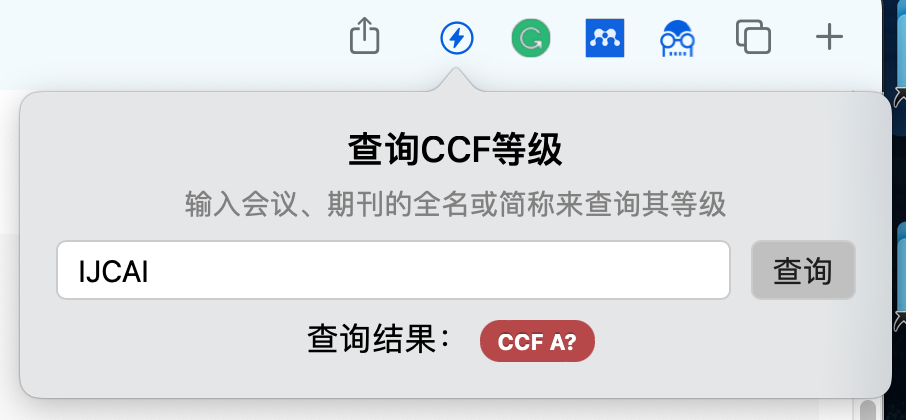

# CCF-Rank-Safari

[English](docs/README_en.md)

在论文搜索结果页面显示会议/期刊等级、支持通过手动输入会议/期刊全名/简称来查询等级的 **Safari** 扩展。

目前支持在 Springer、 DBLP、IEEExplore 和 ACM DL 上显示 CCF 等级（2019）。

> 本项目基于 [hnshhslsh/show-rank](https://github.com/hnshhslsh/show-rank)
>

## 功能介绍

### 原仓库功能介绍

- 在支持的网站上搜索论文时，会自动地在来源前加上会议/期刊的 CCF 等级，并以不同颜色标识。

  

- 如果会议/期刊的简称可以在等级数据库中查询到，但全称并不完全匹配，则会在等级后显示问号`?`。鼠标悬浮在带有问号的标识上时，会显示该等级的简称对应的会议/期刊全称，以供检验。

  

- 鼠标悬浮在没有问号的标识上时，会显示识别到的会议/期刊名称，以供检验。

  

  

### 新功能介绍

- 点击工具栏上的扩展图标会显示一个弹窗，允许通过输入会议/期刊的全名或简称来查询它所属的 CCF 等级。

  

## 使用说明

1. Clone 整个仓库
2. 在 Xcode 中打开 `CCF-Rank.xcodeproj`，将项目设置中 Signing & Capabilities 部分的 Team 改为自己的开发者账号（无需付费账号）
3. 选择 `CCF-Rank (macOS)` 作为运行目标，点击运行按钮进行编译
4. 在打开的窗口中根据提示前往 Safari 添加并启用扩展

## TODO

- [ ] 移除 jQuery 以减小体积
- [x] 更新排名列表至 2022 版
