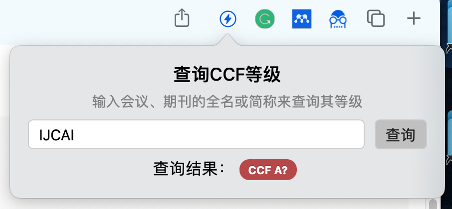

# CCF-Rank-Safari

A **Safari** extension to show conference/journal ranks on the paper search results page.

Currently supports displaying CCF(China Computer Federation) ranks on Springer, DBLP, IEEExplore, and ACM DL.

> This repository is based on [hnshhslsh/show-rank](https://github.com/hnshhslsh/show-rank).

## Introduction

- When searching for papers on the supported sites, the CCF rankings of conferences/journals are automatically placed before the sources and marked with different colors.

  

- If the abbreviation of the conference/journal can be found in the ranking database, but the full name does not match, a question mark `?` will be displayed after the ranking. When the mouse is hovering over a ranking with a question mark, the full name of the conference/journal corresponding to the abbreviation of this ranking will be displayed for inspection.

  

- When the mouse is hovering over a ranking without a question mark, the recognized meeting/journal name will be displayed for inspection.

  

  

- Clicking on the extension icon on the toolbar will display a pop-up window that allows you to search for the CCF level of a conference/journal by entering its full name or abbreviation。

  

## Usage

1. Clone the entire repository
2. Open `CCF-Rank.xcodeproj` in Xcode. Change `Signing & Capabilities` settings according to your developer account.
3. Choose `CCF-Rank (macOS)` as run scheme, click Run button to build and run the project
4. Enable the extension in Safari (you can follow the instructions shown in the app)